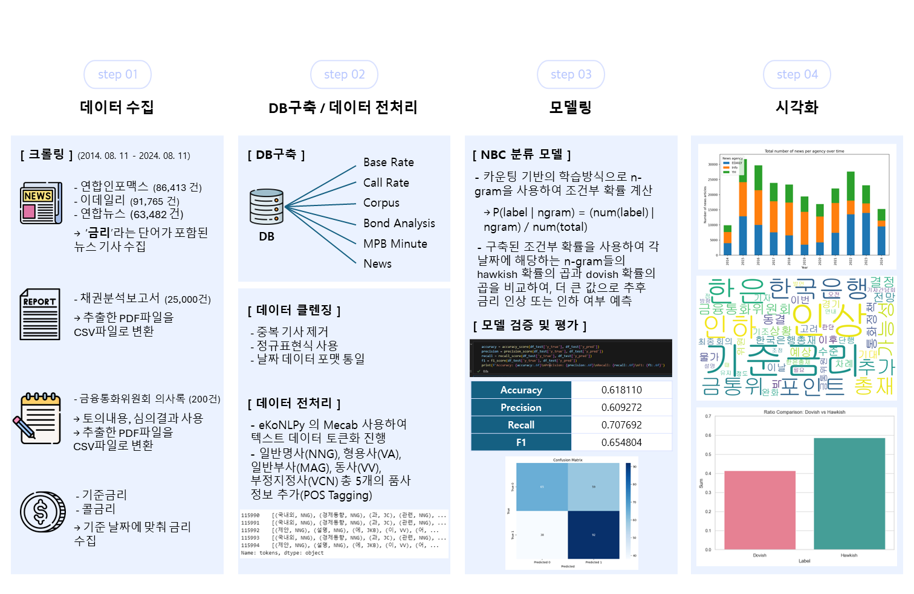

# 📌 기준 금리 예측 프로젝트
## 1. 프로젝트 개요

## 2. 프로젝트 목적
Deciphering Monetary Policy Board Minutes with Text Mining: The Case of South Korea 논문 구현 프로젝트로 뉴스기사, 채권분석리포트, 금융통화위원회 의사록을 크롤링해 텍스트 데이터를 얻고 데이터를 자연어 처리, 모델링 과정을 거쳐 감성 분석을 진행한 후 이를 통해 머신러닝, 딥러닝 모델에 학습시켜 다음 금리의 방향성을 예측하고자 한다.
<!-- - 프로젝트 기간 : 2024.08.08 - 2024.08.28
- 프로그래밍 언어 : Python
- 팀원 : 김도형, 김관용, 원형일, 윤종헌, 이현정 -->

 

## 3. 프로젝트 기간
2024년 8월 8일 - 2024년 8월 28일

 

## 4. 프로젝트 진행
✔ <b>데이터 수집</b>
<ul>
<li>연합뉴스, 연합인포맥스, 이데일리</li>
<li>채권 분석 보고서</li>
<li>금융통화위원회 의사록</li>
<li>콜 금리</li>
</ul>

 

✔ <b>데이터 전처리  </b>
<ul>
<li>토큰화 : 긴 문자열의 텍스트를 토큰(단어)로 분할 / 품사(POS)태깅</li>
<li>정규화 : 텍스트를 하나의 표준 형식으로 변환(구두점 제거, 마침표 제거, 숫자를 해당 단어로 변환, 어간, 철자법, 대소문자 접기 등)</li>
<li>eKoNLPy : 제와 금융에 특화된 사전을 구축하고 자체 형태소 분석기를 사용</li>
</ul>

 

✔ <b>모델링 및 평가 </b>
<ul>
<li>n-gram : 단어의 품사를 명사(NNG), 형용사(VA), 부사(MAG), 동사(VV), 부정사(VCN) 총 5개로 설정</li>
<li>극성분류</li>
<li>Deep Learning</li>
<li>NBC</li>
</ul>

 

## 5. 프로젝트 환경 및 언어
✔ <b>개발 환경</b> : Visual Studio Code, Jupyter Lab, Notion, Github, SLACK, Google Drive  
 
✔ <b>개발 언어 및 모듈</b> : Python 3.8, Pandas, Numpy, Multiprocessing

 

## 6. 팀(BOK_TEAM_1) 구성
- 김도형(팀장) : dkswhale@gmail.com      
- 김관용 : kwanyou2@gmail.com  
- 윤종헌 : yoonjh0420@gmail.com  
- 이현정 : rachel918@hanmail.net  
- 원형일 : raphawon@gmail.com

 

## 7. 기타
- [Notion](https://www.notion.so/970acb4571a942bc999f19e400ced872)
- [github](https://github.com/sesac-analyst/BOK_TEAM_1/tree/main)

<!-- #### 1. 프로젝트 목적
##### 금융통화위원회 의사록, 언론사 기사, 채권분석 리포트의 ***text***를 자연어 처리를 통해
##### 머신러닝에 활용 할 수 있는 ***data***로 변환시켜 2개월 후 기준금리를 예측
#### 2. 프로젝트 기간
##### 2024년 8월 8일 ~ 2024년 8월 28일
#### 3. 프로젝트 진행
##### 3-1. 데이터 수집
   ##### - 연합뉴스, 연합인포맥스, 이데일리
   ##### - 채권분석 리포트
   ##### - 금융통화위원회 의사록
   ##### - 콜 금리
##### 3-2. 데이터 전처리
##### 3-3. 모델링 및 평가
#### 4. 프로젝트 환경
##### Visual Studio Code, Jupyter Lab, Notion, Github, SLACK

##### Python 3.8, Pandas, Numpy, Multiprocessing

#### 5. 팀(BOK_TEAM_1) 구성 

##### 김도형(팀장), 김관용, 윤종헌, 이현정, 원형일 -->
