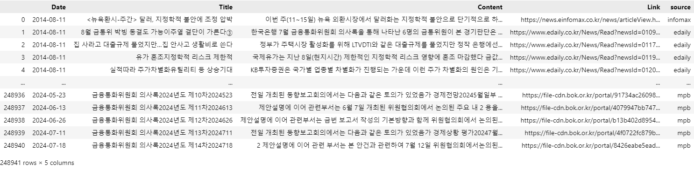
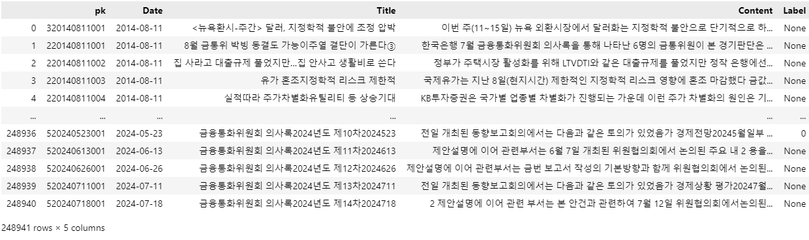
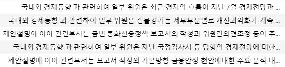
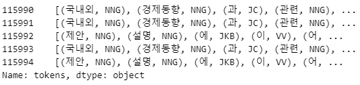
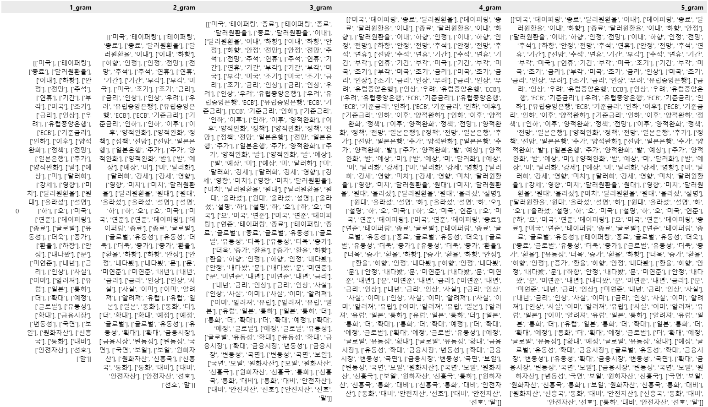

## 1. 데이터 수집 및 초기 로드
CSV 데이터:<br>
News_U.csv: '금리' 키워드의 뉴스 기사 데이터<br>
cleaned_bond.csv: 채권 데이터<br>
cleaned_MPB.csv: 통화정책회의 의사록(Monetary Policy Board, MPB) 데이터<br>
call_rates_3.csv: 콜 금리 데이터<br>
<br>
 ### 1-1. 데이터 출처 표기 위해 source 컬럼 추가
```python
# add source column to identify the source of the news
df_news['source'] = df_news['Link'].apply(lambda x: 'infomax' if 'infomax' in x else ('edaily' if 'edaily' in x else 'yh' if 'yna' in x else None))
df_bond['source'] = 'bond'
df_mpb['source'] = 'mpb'
```
### 1-2. MPB 데이터프레임 컬럼 통합하여 데이터 차원 통일, 컬럼 이름 통일
```python
df_mpb_mod = df_mpb.copy()
df_mpb_mod = df_mpb_mod[['date', 'title', 'link', 'source']]
df_mpb_mod['Content'] = df_mpb['discussion'] + df_mpb['decision']
df_mpb_mod.rename(columns={'date': 'Date', 'title': 'Title', 'link': 'Link'}, inplace=True)
df_mpb_mod.head()
```

### 1-3. Date 컬럼의 자료형을 datetime으로 통일
```python
# change Date column's datatype from object to datetime
df_news['Date'] = pd.to_datetime(df_news['Date'], format='%Y.%m.%d')
df_bond['Date'] = pd.to_datetime(df_bond['Date'], format='%Y.%m.%d')
df_mpb_mod['Date'] = pd.to_datetime(df_mpb_mod['Date'], format='%Y.%m.%d')
df_call['Date'] = pd.to_datetime(df_call['Date'], format='%Y.%m.%d')
```

### 1-4. 불필요 데이터 삭제
```python
# drop unnecessary columns before merging
df_bond.drop(columns=['Unnamed: 0'], inplace=True)
```

### 1-5. 통합 데이터프레임 생성(뉴스, 채권, MPB)
```python
df_corp = pd.concat([df_news, df_bond, df_mpb_mod], ignore_index=True)
df_corp
```


통합 데이터프레임(df_corp)

<br>

## 2. 데이터 레이블링

### 2-1. 각 데이터의 출처와 날짜를 기준으로 primary key 생성
```python
pk_dict = {'yh': '1', 'edaily': '2', 'infomax': '3', 'bond': '4', 'mpb': '5'}
df_corp['counter'] = df_corp.groupby(['source', 'Date']).cumcount() + 1
df_corp['source_num'] = df_corp['source'].map(pk_dict)
# primary key 생성
df_corp['pk'] =  df_corp['source_num'] + df_corp['Date'].dt.strftime('%Y%m%d') + df_corp['counter'].apply(lambda x: f'{x:03}')
df_corp['pk']

df_corpus = df_corp[['pk', 'Date', 'Title', 'Content']]
```

### 2-2. 콜금리 데이터를 기반으로 당일 기준금리 변동 여부에 따라 '1', '0', 또는 결측치(NaN)로 레이블을 지정
```python
def calculate_label(article_date):
    if article_date not in df_call['Date'].values:
        return None
    
    current_rate = df_call.loc[df_call['Date'] == article_date, 'Call_Rate'].values[0]
    next_date = article_date + pd.DateOffset(months=2)
    if next_date not in df_call['Date'].values:
        return None
    
    next_rate = df_call.loc[df_call['Date'] == next_date, 'Call_Rate'].values[0]
    difference = next_rate - current_rate

    if difference > 0.01:
        label = '1'
    elif difference < -0.01:
        label = '0'
    else:
        label = np.nan

    results.append({
        'Date': article_date,
        'Date+2m': next_date,
        'Current_rate': current_rate,
        'Rate+2m': next_rate,
        'Difference': difference,
        'Label': label
    })

    return label

    df_corpus['Label'] = df_corpus['Date'].apply(calculate_label)
df_corpus
```


라벨링 데이터프레임(df_corpus)
### 2-3. Label 값이 NaN 인 데이터 제거
```python
df_corpus.dropna(inplace=True)
df_corpus['Label'].value_counts()
```
제거 후 레이블별 데이터<br>
1 : 64902<br> 
0 : 51235<br>
<br>
## 3. 토큰화 및 정규화
eKoNLPy와 Mecab을 사용하여 텍스트 데이터를 토큰화하고, 각 단어의 품사 정보를 추가(POS Tagging)<br>
사용 라이브러리 :<br>
eKoNLPy : 한국어 경제 용어 사전<br>
Mecab : 토큰화, 품사태깅<br>
multiprocessing : 멀티프로세싱 적용<br>
<br>

```python
# 토크나이저 & POS tagging
import pandas as pd
from ekonlpy.tag import Mecab
from multiprocessing import Pool

# Initialize Mecab
mecab = Mecab()

def tokenize_and_pos(text):
    """ Tokenize and perform POS tagging using Mecab. """
    return mecab.pos(text)

def process_in_batches(df, batch_size=1000, output_prefix='processed_batch'):
    """ Process data in batches to handle large datasets and save intermediate results. """
    for start in range(0, len(df), batch_size):
        end = min(start + batch_size, len(df))
        batch = df.iloc[start:end].copy()  # Create a copy of the slice
        batch['tokens_pos'] = batch['Content'].apply(tokenize_and_pos)
        # Save intermediate results
        batch.to_csv(f'{output_prefix}_{start}.csv', index=False)

def parallel_process(df):
    """ Use parallel processing to speed up the tokenization and POS tagging. """
    with Pool() as pool:
        df['tokens_pos'] = pool.map(tokenize_and_pos, df['Content'])
    return df

def main():
    # Load your dataset (adjust the path to your file)
    df = pd.read_csv("../data_combine/corpus_data.csv")  # Ensure your CSV file has a column named 'Content'

    # Process in batches
    process_in_batches(df, batch_size=1000, output_prefix='processed_batch')

    # Combine all intermediate results into a final file
    import glob
    import os

    # List all batch files
    batch_files = glob.glob('processed_batch_*.csv')

    # Initialize an empty DataFrame for the final result
    final_df = pd.DataFrame()

    # Append each batch file to the final DataFrame
    for batch_file in sorted(batch_files):
        batch_df = pd.read_csv(batch_file)
        final_df = pd.concat([final_df, batch_df], ignore_index=True)

    # Save the final result to a different name
    final_df.to_csv('tokenized.csv', index=False)

    # Optionally, clean up intermediate batch files
    for batch_file in batch_files:
        os.remove(batch_file)

if __name__ == "__main__":
    main()
```
<br>
토큰화, 품사태깅 전


<br>
토큰화, 품사태깅 후
<br>
<br>

## 4. n-그램 분석

### 4-1. 병렬처리를 위해 통합 데이터를 10개로 분리

```python
# Split the DataFrame into 8 equal parts
df_parts = np.array_split(df_corpus, 10)

# Save each part as a separate CSV file
for i, part in enumerate(df_parts):
    part.to_csv(f'corpus_tokenized_{i+1}.csv', index=False)
```

<br>

### 4-2. n-grams 분석에 필요한 품사를 필터링

필터링 품사 :<br>
NNG (일반명사)<br>
VA (형용사)<br>
MAG (일반부사)<br>
VV (동사)<br>
VCN (부정 지정사)<br>

```python
def ngramize_doh(tokens, n, pos_tags=['NNG', 'VA', 'MAG', 'VV', 'VCN']):
    filtered_tokens = [token for token, pos in tokens if pos in pos_tags]
    return [filtered_tokens[i:i+n] for i in range(len(filtered_tokens)-n+1)]
```

### 4-3. 토큰화 텍스트 데이터(tokens_pos 컬럼)를 리스트로 파싱
```python
cor_7['parsed_tokens'] = cor_7['tokens_pos'].apply(ast.literal_eval)
cor_7['parsed_tokens']
```

<br>

### 4-3. n-grams 분석 (1-grams to 5-grams)
```python
for idx in range(1, 6):
    cor_7[f'{idx}gram'] = cor_7['parsed_tokens'].apply(lambda x: ngramize(x, idx))
    globals()[f'corpus7_{idx}gram'] = cor_7[['pk', 'Date', 'Label', f'{idx}gram']].copy()
```
